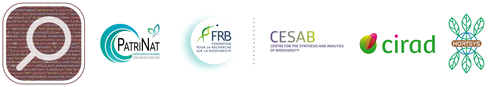

```{r setup, include=FALSE}
knitr::opts_chunk$set(echo = FALSE)
```





<br />


This five-day workshop, organized by the 
[FRB-CESAB](https://www.fondationbiodiversite.fr/en/about-the-foundation/le-cesab/),
aims to train young researchers on the methods and techniques of meta-analyses 
and systematic reviews/maps applied to the field of biodiversity.

The first edition of this training course will take place from the 3rd to the 
7th of October 2022 in the CESAB premises in Montpellier.


<br />


## Program


Coming soon...


<br/>


## Prerequisites


Please follow this [tutorial](instructions.html) to correctly install your 
working environment (R, RStudio, git, etc.).


## Corrections {.appendix}


If you see mistakes or want to suggest changes, please 
[Create an issue](https://github.com/literaturesynthesis/literaturesynthesis.github.io/issues)
on the source repository.


## Reuse {.appendix}


The material of this website is licensed under Creative Commons Attribution 
[CC BY 4.0](https://creativecommons.org/licenses/by/4.0/).
Source code is available at https://github.com/literaturesynthesis/literaturesynthesis.github.io/.


## Citation {.appendix}


Beillouin D, Bonfanti J, Campagne CS, Casajus N & Langridge J (2022) 
Workshop FRB-CESAB: Literature Synthesis, Meta-analyses and Systematic reviews (Edition 2022). 
